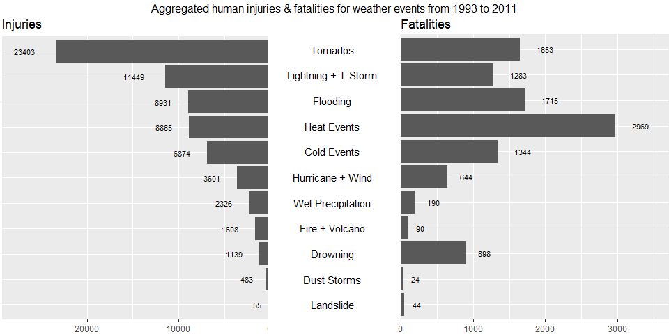
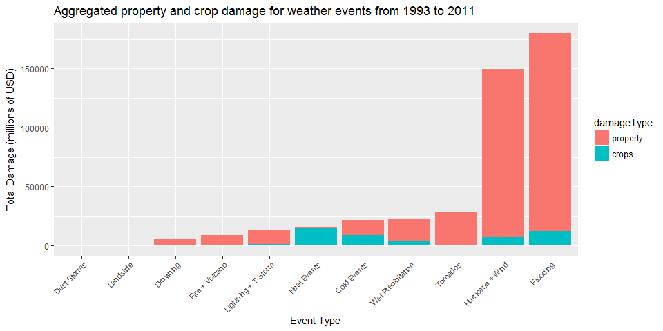

# Analysis of NOAA Weather Events
#####Marc Haserodt
#####February 10, 2017
### 1. Assignment

The basic goal of this assignment is to explore the NOAA Storm Database and answer some basic questions about severe weather events. You must use the database to answer the questions below and show the code for your entire analysis. Your analysis can consist of tables, figures, or other summaries. You may use any R package you want to support your analysis.

### 2. Synopsis

The NOAA Storm Database incorporates storm event data such as date, location, number of victims, and property damage estimates.  This report analyzes which events have the most financial impact and are the most dangerous to people.

The inference of this research is that there is little correlation between the economic impact and human impact.  Heat Events, Tornados, Lightning + T-Storm, Flooding, and Cold Events are the top 5 sources of fatalities, while Flooding, and Hurricane + Wind, combined account for over 80% of all economic impact.

### 3. Process the Data

##### 3-1. Set working directory and download the data from source

```r
setwd("C:/Users/marc.haserodt/RepData_PeerAssessment2")
url <- "https://d396qusza40orc.cloudfront.net/repdata%2Fdata%2FStormData.csv.bz2"
download.file(url, "StormData.csv.bz2")
```

##### 3-2. Load libraries

```r
library(ggplot2)
library(grid)
library(gridExtra)
library(plyr)
library(R.utils)
```

```
## Loading required package: R.oo
```

```
## Loading required package: R.methodsS3
```

```
## R.methodsS3 v1.7.1 (2016-02-15) successfully loaded. See ?R.methodsS3 for help.
```

```
## R.oo v1.21.0 (2016-10-30) successfully loaded. See ?R.oo for help.
```

```
## 
## Attaching package: 'R.oo'
```

```
## The following objects are masked from 'package:methods':
## 
##     getClasses, getMethods
```

```
## The following objects are masked from 'package:base':
## 
##     attach, detach, gc, load, save
```

```
## R.utils v2.5.0 (2016-11-07) successfully loaded. See ?R.utils for help.
```

```
## 
## Attaching package: 'R.utils'
```

```
## The following object is masked from 'package:utils':
## 
##     timestamp
```

```
## The following objects are masked from 'package:base':
## 
##     cat, commandArgs, getOption, inherits, isOpen, parse, warnings
```

```r
library(RCurl)
```

```
## Loading required package: bitops
```

```
## 
## Attaching package: 'RCurl'
```

```
## The following object is masked from 'package:R.utils':
## 
##     reset
```

```
## The following object is masked from 'package:R.oo':
## 
##     clone
```

```r
library(reshape2)
library(scales)
```
##### 3-3. Read the data file
Read the source .csv file

```r
  stormCsv <- read.csv("StormData.csv.bz2")
```

##### 3-4. Remove unnecessary columns 

```r
  keepColumns <- c("BGN_DATE", "EVTYPE", "FATALITIES", "INJURIES", "PROPDMG", "PROPDMGEXP", "CROPDMG", "CROPDMGEXP")
  stormTrimmed <- stormCsv[, keepColumns]
  stormTrimmed <- rename(stormTrimmed, c("FATALITIES"="fatalities", "INJURIES"="injuries"))
head(stormTrimmed)
```

```
##             BGN_DATE  EVTYPE fatalities injuries PROPDMG PROPDMGEXP
## 1  4/18/1950 0:00:00 TORNADO          0       15    25.0          K
## 2  4/18/1950 0:00:00 TORNADO          0        0     2.5          K
## 3  2/20/1951 0:00:00 TORNADO          0        2    25.0          K
## 4   6/8/1951 0:00:00 TORNADO          0        2     2.5          K
## 5 11/15/1951 0:00:00 TORNADO          0        2     2.5          K
## 6 11/15/1951 0:00:00 TORNADO          0        6     2.5          K
##   CROPDMG CROPDMGEXP
## 1       0           
## 2       0           
## 3       0           
## 4       0           
## 5       0           
## 6       0
```

##### 3-5. Manipulate BGN_DATE
There is a greater number of observations in later years which could skew result.  Setting cutoff at 80% to capture most observations.

```r
  totalObs <- nrow(stormTrimmed)
  trimPercent = 0.80
  trimObs = round(totalObs * trimPercent)
  
  stormTrimmed$year = as.numeric(format(as.Date(stormTrimmed$BGN_DATE, format = "%m/%d/%Y"), "%Y"))
  
  # create dataset with annual count 
  yearRecords <- count(stormTrimmed, "year")
  yearRecords <- yearRecords[order(yearRecords$year, decreasing=TRUE), ]
  yearRecords$runningTotal = cumsum(yearRecords$freq)
  cutOffYear <- min(yearRecords[yearRecords$runningTotal < trimObs, 1])
  
  # trim the dataset further
  stormTrimmed <- stormTrimmed[stormTrimmed$year >= cutOffYear, ]
  endYear <- max(stormTrimmed$year)
  
  # clean stormTrimmed
  stormTrimmed$BGN_DATE <- NULL
  rownames(stormTrimmed) <- NULL
head(stormTrimmed)
```

```
##                  EVTYPE fatalities injuries PROPDMG PROPDMGEXP CROPDMG
## 1         FREEZING RAIN          0        0       0                  0
## 2                  SNOW          0        0       0                  0
## 3 ICE STORM/FLASH FLOOD          0        2       0                  0
## 4              SNOW/ICE          0        0       0                  0
## 5          WINTER STORM          4        0       5          B       0
## 6              SNOW/ICE          0        0       0                  0
##   CROPDMGEXP year
## 1            1995
## 2            1995
## 3            1994
## 4            1995
## 5            1993
## 6            1995
```

##### 3-6. Manipulate EVTYPE 
The event types have several categories that are similar and can be grouped together to further clean and reduce the dataset.

```r
  stormTrimmed$damageSource <- NA
  
  stormTrimmed[grepl("precipitation|rain|hail|drizzle|wet|percip|burst|depression|fog|wall cloud", 
                         stormTrimmed$EVTYPE, ignore.case = TRUE), "damageSource"] <- "Wet Precipitation"
  stormTrimmed[grepl("wind|storm|wnd|hurricane|typhoon", 
                         stormTrimmed$EVTYPE, ignore.case = TRUE), "damageSource"] <- "Hurricane + Wind"
  stormTrimmed[grepl("slide|erosion|slump", 
                         stormTrimmed$EVTYPE, ignore.case = TRUE), "damageSource"] <- "Landslide"
  stormTrimmed[grepl("warmth|warm|heat|dry|hot|drought|thermia|temperature record|record temperature|record high", 
                         stormTrimmed$EVTYPE, ignore.case = TRUE), "damageSource"] <- "Heat Events"
  stormTrimmed[grepl("cold|cool|ice|icy|frost|freeze|snow|winter|wintry|wintery|blizzard|chill|freezing|avalanche|glaze|sleet", 
                         stormTrimmed$EVTYPE, ignore.case = TRUE), "damageSource"] <- "Cold Events"
  stormTrimmed[grepl("flood|surf|blow-out|swells|fld|dam break", 
                         stormTrimmed$EVTYPE, ignore.case = TRUE), "damageSource"] <- "Flooding"
  stormTrimmed[grepl("seas|high water|tide|tsunami|wave|current|marine|drowning", 
                         stormTrimmed$EVTYPE, ignore.case = TRUE), "damageSource"] <- "Drowning"
  stormTrimmed[grepl("dust|saharan", 
                         stormTrimmed$EVTYPE, ignore.case = TRUE), "damageSource"] <- "Dust Storms"  
  stormTrimmed[grepl("tstm|thunderstorm|lightning", 
                         stormTrimmed$EVTYPE, ignore.case = TRUE), "damageSource"] <- "Lightning + T-Storm"
  stormTrimmed[grepl("tornado|spout|funnel|whirlwind", 
                         stormTrimmed$EVTYPE, ignore.case = TRUE), "damageSource"] <- "Tornados"
  stormTrimmed[grepl("fire|smoke|volcanic", 
                         stormTrimmed$EVTYPE, ignore.case = TRUE), "damageSource"] <- "Fire + Volcano"
  
  
  stormTrimmed <- stormTrimmed[complete.cases(stormTrimmed[, "damageSource"]), ]
  stormTrimmed$damageSource <- as.factor(stormTrimmed$damageSource)
  
  
  stormTrimmed$EVTYPE <- NULL

  head(stormTrimmed)
```

```
##   fatalities injuries PROPDMG PROPDMGEXP CROPDMG CROPDMGEXP year
## 1          0        0       0                  0            1995
## 2          0        0       0                  0            1995
## 3          0        2       0                  0            1994
## 4          0        0       0                  0            1995
## 5          4        0       5          B       0            1993
## 6          0        0       0                  0            1995
##   damageSource
## 1  Cold Events
## 2  Cold Events
## 3     Flooding
## 4  Cold Events
## 5  Cold Events
## 6  Cold Events
```

##### 3-7. Convert CROPDMG, CROPDMGEXP, PROPDMG, and PROPDMGEXP to absolute values


```r
  toTenPower <- function(x){
    if(is.numeric(x)) {
      x <- x
    }
    else if(grepl("h", x, ignore.case=TRUE)) {
      x <- 2
    }
    else if(grepl("k", x, ignore.case=TRUE)) {
      x <- 3
    }
    else if(grepl("m", x, ignore.case=TRUE)) {
      x <- 6
    }
    else if(grepl("b", x, ignore.case=TRUE)) {
      x <- 9
    }
    else if(x == "" || x == " "){
      x <- 0
    }
    else{
      x <- NA
    }
    x
  }
   
  
  calcAmount <- function(num, exp){
    pow <- toTenPower(exp)
    if(is.numeric(num)){
      num <- num * (10 ^ pow)
    }
    
    if(!is.numeric(num)){
      num <- 0
    }
    
    num
  }
  

  stormTrimmed$propDamage <- mapply(calcAmount, stormTrimmed$PROPDMG, stormTrimmed$PROPDMGEXP)
  stormTrimmed$cropDamage <- mapply(calcAmount, stormTrimmed$CROPDMG, stormTrimmed$CROPDMGEXP)
  stormTrimmed$damageTotal = stormTrimmed$propDamage + stormTrimmed$cropDamage
  
  
  stormTrimmed$PROPDMG <- NULL
  stormTrimmed$PROPDMGEXP <- NULL
  stormTrimmed$CROPDMG <- NULL
  stormTrimmed$CROPDMGEXP <- NULL
head(stormTrimmed)
```

```
##   fatalities injuries year damageSource propDamage cropDamage damageTotal
## 1          0        0 1995  Cold Events      0e+00          0       0e+00
## 2          0        0 1995  Cold Events      0e+00          0       0e+00
## 3          0        2 1994     Flooding      0e+00          0       0e+00
## 4          0        0 1995  Cold Events      0e+00          0       0e+00
## 5          4        0 1993  Cold Events      5e+09          0       5e+09
## 6          0        0 1995  Cold Events      0e+00          0       0e+00
```

##### 3-8. Create dataset and variables for plots

```r
  ecoDamage <- aggregate(formula=cbind(propDamage, cropDamage, damageTotal) ~ damageSource, data=stormTrimmed, FUN=sum, na.rm=TRUE)
  ecoDamage <- ecoDamage[order(ecoDamage$damageTotal, decreasing=TRUE),]
  rownames(ecoDamage) <- NULL
  ecoDamage$damageSource <- factor(ecoDamage$damageSource, levels=rev(ecoDamage$damageSource))
  
  
  ecoDamageMelt <- melt(ecoDamage, id.vars=c("damageSource"), measure.vars=c("propDamage","cropDamage"), variable.name="damageType", value.name="damage")
  levels(ecoDamageMelt$damageType)[levels(ecoDamageMelt$damageType)=="propDamage"] <- "property"
  levels(ecoDamageMelt$damageType)[levels(ecoDamageMelt$damageType)=="cropDamage"] <- "crops"
  
  
  humanDamage <-aggregate(formula=cbind(injuries, fatalities) ~ damageSource, data=stormTrimmed, FUN=sum, na.rm=TRUE) 
  humanDamage <- humanDamage[order(humanDamage$injuries, decreasing=TRUE),]
  rownames(humanDamage) <- NULL
  humanDamage$damageSource <- factor(humanDamage$damageSource, levels=rev(humanDamage$damageSource))
  
  maxInjury <- max(humanDamage$injuries)
  maxInjury <- maxInjury + round(maxInjury * 0.25)
 
  maxFatality <- max(humanDamage$fatalities)
  maxFatality <- maxFatality + round(maxFatality * 0.25)  
```

##### 3-10. Save to RData

```r
  save(stormTrimmed, 
       humanDamage, 
       ecoDamageMelt,
       ecoDamage, 
       maxInjury, 
       maxFatality,
       cutOffYear,
       endYear,
       file="StormData.RData")
```


### 4. Results
##### 4-1. Show the first & last 5 lines of the new data set


```r
head(stormTrimmed, n=5L)
```

```
##   fatalities injuries year damageSource propDamage cropDamage damageTotal
## 1          0        0 1995  Cold Events      0e+00          0       0e+00
## 2          0        0 1995  Cold Events      0e+00          0       0e+00
## 3          0        2 1994     Flooding      0e+00          0       0e+00
## 4          0        0 1995  Cold Events      0e+00          0       0e+00
## 5          4        0 1993  Cold Events      5e+09          0       5e+09
```

```r
tail(stormTrimmed, n=5L)
```

```
##        fatalities injuries year     damageSource propDamage cropDamage
## 714734          0        0 2011 Hurricane + Wind          0          0
## 714735          0        0 2011 Hurricane + Wind          0          0
## 714736          0        0 2011 Hurricane + Wind          0          0
## 714737          0        0 2011      Cold Events          0          0
## 714738          0        0 2011      Cold Events          0          0
##        damageTotal
## 714734           0
## 714735           0
## 714736           0
## 714737           0
## 714738           0
```

##### 4-2. Examine injuries v fatalities

```r
g.mid <- ggplot(data=humanDamage, aes(x=1,y=damageSource)) +
            geom_text(aes(label=damageSource), size=4) +
            ggtitle("") +
            ylab(NULL) +
            scale_x_continuous(expand=c(0,0),limits=c(0.94,1.065)) +
            theme(axis.title=element_blank(),
                  panel.grid=element_blank(),
                  axis.text.y=element_blank(),
                  axis.ticks.y=element_blank(),
                  panel.background=element_blank(),
                  axis.text.x=element_text(color=NA),
                  axis.ticks.x=element_line(color=NA),
                  plot.margin = unit(c(1,-1,1,-1), "mm"))

# add left chart with injuries
g.injuries <- ggplot(data=humanDamage, aes(x=damageSource, y=injuries)) +
            geom_bar(stat = "identity") + 
            geom_text(aes(label=injuries), size=3, vjust=0.5, hjust=2.0) +
            ggtitle("Injuries") +
            scale_y_reverse(expand=c(0, 0), limits=c(maxInjury,0)) + 
            coord_flip() +
            theme(axis.title.x = element_blank(), 
                  axis.title.y = element_blank(), 
                  axis.text.y = element_blank(), 
                  axis.ticks.y = element_blank(), 
                  plot.margin = unit(c(1,-1,1,0), "mm")) 

# add right chart with fatalities
g.fatalities <- ggplot(data=humanDamage, aes(x=damageSource, y=fatalities)) +
            geom_bar(stat = "identity") + 
            geom_text(aes(label=fatalities), size=3, vjust=0.5, hjust=-1.0) +
            ggtitle("Fatalities") +
            scale_y_continuous(expand=c(0, 0), limits=c(0,maxFatality)) + 
            coord_flip() +
            theme(axis.title.x = element_blank(), 
                  axis.title.y = element_blank(), 
                  axis.text.y = element_blank(), 
                  axis.ticks.y = element_blank(), 
                  plot.margin = unit(c(1,0,1,-1), "mm")) 

# combine charts in one plot
gg.injuries <- ggplot_gtable(ggplot_build(g.injuries))
gg.fatalities <- ggplot_gtable(ggplot_build(g.fatalities))
gg.mid <- ggplot_gtable(ggplot_build(g.mid))

grid.arrange(gg.injuries,gg.mid,gg.fatalities,
             ncol=3,widths=c(4/10,2/10,4/10),
             top=paste("Aggregated human injuries & fatalities for weather events from ",cutOffYear," to ",endYear, sep=""))
```

<!-- -->

The data

```r
humanDamage
```

```
##           damageSource injuries fatalities
## 1             Tornados    23403       1653
## 2  Lightning + T-Storm    11449       1283
## 3             Flooding     8931       1715
## 4          Heat Events     8865       2969
## 5          Cold Events     6874       1344
## 6     Hurricane + Wind     3601        644
## 7    Wet Precipitation     2326        190
## 8       Fire + Volcano     1608         90
## 9             Drowning     1139        898
## 10         Dust Storms      483         24
## 11           Landslide       55         44
```

##### 4.3. Economic Damage
Crop damage is hardly a factor in comparission to the total economic cost of certain weather events, except for Heat & Drought, where it effects more than 90%
The real interesting ones are Wind & Storm and Flooding & High Surf covering together more than 80% of all economic damage over all the years.
Tornado's,Thunderstorms and Snow & Ice, which have high impact in human costs, hardly matter in economic damages

```r
ggplot(ecoDamageMelt, aes(x=damageSource, y=damage/1000000)) + 
  geom_bar(stat = "identity", aes(fill=damageType)) +
  xlab("Event Type") +
  theme(axis.text.x = element_text(angle = 45, size=8, hjust = 1, vjust = 1)) +
  ylab("Total Damage (millions of USD)") +
  ggtitle(paste("Aggregated property and crop damage for weather events from ",cutOffYear," to ",endYear, sep=""))
```

<!-- -->

The data

```r
ecoDamage
```

```
##           damageSource   propDamage  cropDamage  damageTotal
## 1             Flooding 167702697194 12389477200 180092174394
## 2     Hurricane + Wind 142713420213  6961399350 149674819563
## 3             Tornados  28004507463   367458360  28371965823
## 4    Wet Precipitation  18970846467  3958490253  22929336720
## 5          Cold Events  12705867660  8721961900  21427829560
## 6          Heat Events   1062504300 14871450280  15933954580
## 7  Lightning + T-Storm  11909700240  1283798498  13193498738
## 8       Fire + Volcano   8502228500   403281630   8905510130
## 9             Drowning   4809787890    46622500   4856410390
## 10           Landslide    328262100    20017000    348279100
## 11         Dust Storms      6337630     3600000      9937630
```
